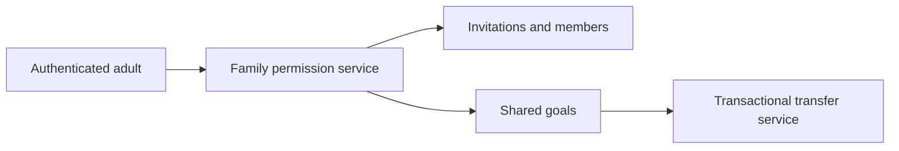
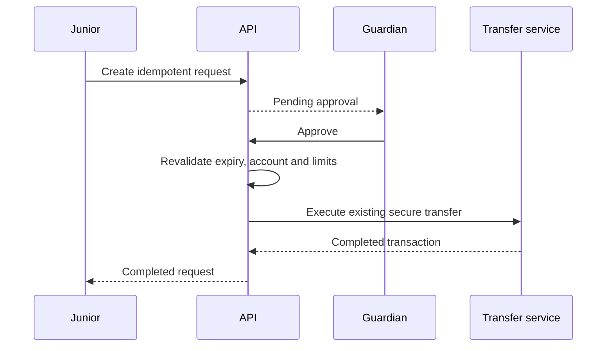
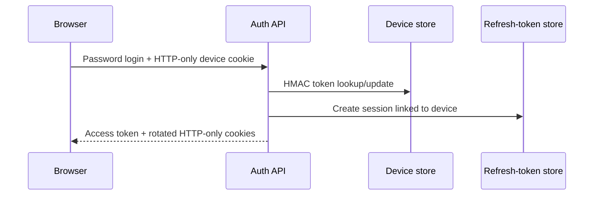

# Architecture

The npm-workspace monorepo separates the React client from the Express API. The API follows:

`Route → validation → authentication/authorization → controller → service → model → MongoDB`

Controllers translate HTTP requests and responses. Services will own business and financial rules. Mongoose models will define persistence. Cross-cutting middleware owns security, errors, and logging. All future financial amounts will use integer minor units and MongoDB transactions.

The planned client structure includes `api`, `assets`, `components`, `context`, `hooks`, `layouts`, `pages`, `routes`, `services`, `utils`, and `validations`. The server structure includes `config`, `controllers`, `middleware`, `models`, `routes`, `services`, `validators`, `utils`, `jobs`, and `tests`.

## Authentication lifecycle

Passwords are hashed with bcrypt. Login returns a short-lived JWT access token while a signed JWT refresh token, hashed at rest, is set as an HttpOnly cookie. Refresh requests rotate that token within a session family; reuse revokes the family. Email verification and password reset use separately scoped, hashed, expiring, attempt-limited codes.

## Account lifecycle

Customers submit Savings or Current account applications. The backend generates a unique 12-digit number beginning with the Duothan `60` prefix and initializes both balance fields to zero minor units. Staff can approve or reject pending applications and manage active/suspended status. Only administrators can close accounts. Administrative transitions create immutable audit records.

## Transfer transaction boundary

The transfer service opens a MongoDB transaction with snapshot reads and majority writes. It conditionally debits the sender, credits the receiver, inserts linked debit/credit records, and inserts an audit record within the same session. Any thrown error aborts every write. The sender record has a unique owner/idempotency-key index, allowing retries to return the original completed result without moving funds twice.

Balances and transaction amounts are safe integer minor units. The conditional debit includes the live stored balance, so concurrent transfers cannot overdraw an account.

## Beneficiary validation

Beneficiaries reference an existing account and retain immutable account-number and registered-name snapshots for display. Creation resolves the account on the backend, requires an active destination, prevents saving the customer’s own accounts, and enforces one saved record per owner/destination pair. Removal always includes the authenticated owner in the deletion predicate.

## Loan lifecycle

Applications reference an owned active account and remain pending. Approval calculates simple interest using integer basis points and integer arithmetic. Loan creation, account credit, disbursement transaction, application update, and audit event share one MongoDB transaction.

Repayments conditionally debit an owned active account, optimistically reduce the loan’s outstanding balance, create `LoanPayment` and customer transaction records, update paid/completed status, and write an audit record in one transaction. Unique owner/idempotency-key indexes make repayment retries safe.

## Dashboard analytics

Role-specific dashboard routes call a dedicated service that uses read-only MongoDB counts and aggregation pipelines. Personal analytics always filter by the authenticated customer identifier. Employee dashboards expose operational totals and high-value activity, while bank-wide totals are limited to administrators. Six-month series are normalized on the server so the client receives zero-filled, display-ready periods.

## Operational controls

Notification creation occurs alongside the event that generated it and respects the recipient's preferences. High-value transfers create an investigation record inside the same MongoDB transaction. Staff can append investigation notes and change workflow status without modifying the financial transaction. Administrator settings are allow-listed, type-validated, and audited; transaction and loan limit settings override environment defaults at runtime.

## Client delivery and resilience

Each page is loaded through a route-level dynamic import. Authentication and layout infrastructure remain in the initial bundle, while role pages and chart libraries load only when requested. A top-level error boundary provides a safe recovery screen for unexpected rendering failures without suggesting that a financial action completed.

## Family, junior and device flows

Family membership is not account authorization. Junior profiles are server-owned policy records rather than browser-assigned roles. Device user-agent data is a display hint only; proof uses a random cookie whose HMAC digest is stored.

## Deployment and recovery

Netlify serves the static SPA with fallback routing, Render hosts the stateless Express API, and Atlas supplies a transaction-capable MongoDB replica set. Provider secrets remain outside Git. Recovery restores a verified backup in isolation, reconciles ledger relationships and promotes a known application release; completed financial records are never deleted as a repair shortcut.
