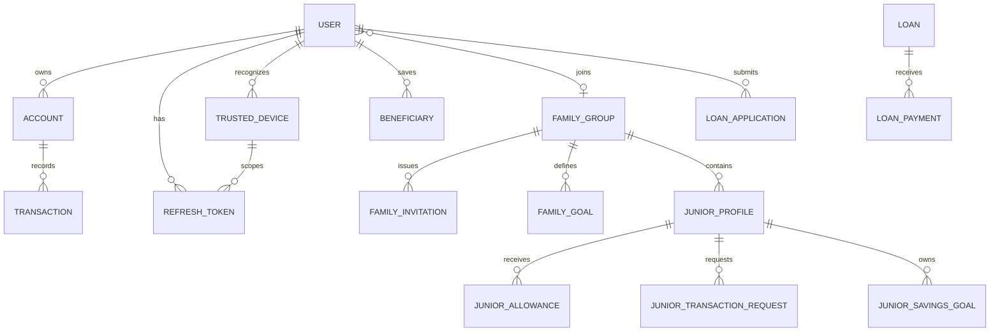

# Database Schema

MongoDB ObjectIds connect the collections below. Financial amounts use safe integer LKR minor units. Important financial, family, approval and audit history is retained instead of physically deleted.

## Identity and security

- `User`: identity, bcrypt password hash, role, status, verification and lockout state.
- `RefreshToken`: hashed rotating refresh token, session family, expiry, revocation and trusted-device link.
- `OTP` and `PasswordResetToken`: purpose-scoped, hashed, expiring one-time credentials.
- `TrustedDevice`: HMAC device-token hash, safe display metadata, lifecycle and trust expiry.
- `LoginHistory`: result, device, login method, risk level/signals and logout time.

## Banking

- `Account`: owner, backend-generated account number, ledger/available balances, lifecycle and junior restriction marker.
- `Transaction`: immutable transfer/loan ledger event, idempotency hash, references and balance snapshot.
- `Beneficiary`: owner-scoped destination with immutable account identity snapshot.
- `LoanApplication`, `Loan`, `LoanPayment`: application decision, disbursed obligation and idempotent payments.

## Family and junior banking

- `FamilyGroup`: members, family roles and explicit permissions.
- `FamilyInvitation`: expiring invitation and non-destructive status history.
- `FamilyGoal`, `FamilyGoalContribution`: shared goal and idempotent contributions.
- `FamilyAnnouncement`: permission-controlled family messages.
- `JuniorProfile`: guardian relationships, controls, limits and approval policy.
- `JuniorAllowance`: scheduled allowance definition and execution state.
- `JuniorTransactionRequest`: expiring request and guardian decision.
- `JuniorBeneficiaryPermission`: approved/rejected/blocked beneficiary access.
- `JuniorSavingsGoal`: personal target and secure contribution references.

## Operations

- `Notification`: owner-scoped alerts and read state.
- `AuditLog`: immutable actor, action, target and before/after evidence.
- `SuspiciousActivity`: investigation workflow without mutating transactions.
- `SystemSetting`: allow-listed runtime operational settings.

Indexes enforce unique identities and idempotency, optimize ownership/status queries, and expire eligible temporary credentials through TTL indexes.
